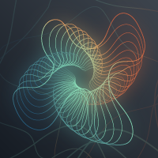

  

  <h2>any-shape<h2/>

**Tools for less boilerplate, more flow.**

We’re building `any-shape` — a home for modular, high-performance tools that automate the boring stuff and help developers focus on what actually matters.

## 🧩 What We Make

– ⚙️ Node.js/Nuxt 3/4 modules for auto-generating API logic  
– 🧰 CLI tools for speeding up workflows  
– 🔄 SQL/Rust/Go snippets for data, system, and process automation  
– 💡 Gists and dev tips to cut through routine and friction  

All our tools are:
- **Fully open-source**
- **Type-safe and scalable**
- **Designed for mid/senior devs**

## 🧭 Why We Do It

We believe that great developer tools should feel invisible — working quietly in the background to make your job easier. Every script, module, or CLI we release is something we’ve needed ourselves to ship faster, cleaner, and with less mental overhead.

If it saves us time, it might save you hours.

## ☕ Support & Involvement

Found something helpful? Here’s how you can support us:

- ⭐️ [Star our repositories](https://github.com/any-shape) — visibility helps  
- 🛠 [Contribute ideas or code](https://github.com/any-shape) — we love PRs  
- ☕ [Buy us a coffee](https://www.buymeacoffee.com/anyshape) — keeps the lights on  
- 🧵 [Follow on GitHub](https://github.com/any-shape) — new tools dropping regularly

## 📬 Stay in the Loop

More tools and improvements are on the way.  
Follow the org or check out our pinned projects for what's live.

---

Built by devs. For devs. For less grind and more *flow*.
